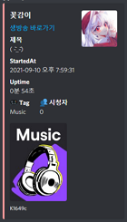

# FlowerGam0326

## 꽃감이 트위치 방송 알림 프로그램 ( 디스코드 웹훅 or 프로그램 알림)

* [트위치 바로가기](https://www.twitch.tv/flowergam0326)
* [노래 유튜브](https://www.youtube.com/channel/UCIiAsSxd21ZGabut95VYYgw)
* [서브 유튜브](https://www.youtube.com/channel/UCvFBlZPInHWf8eE4WUkKS6A)
* [JP 유튜브](https://www.youtube.com/channel/UCX3ELg-sB0Y3pWpOVIW8CpA)
* [인스타그램](https://www.instagram.com/flowergam/)

----

### 기능

* 트위치 Live 확인
    > 트위치 API를 통해 방송중인지 확인합니다.

* 디스코드 웹훅으로 알림 보내기
    > 라이브 방송이 확인되면 디스코드 웹훅 링크를 통해 알림을 전송합니다.

  * 

### 요구 사항

* [.NET Framework 4.7.2 버전이 필요합니다.](https://dotnet.microsoft.com/download/dotnet-framework/net472)
* 디스코드 웹훅 링크가 필요합니다. (단순 프로그램 알림만 사용할 경우 필요하지 않습니다.)
* 트위치 API 토큰이 필요합니다. [트위치 API DOC](https://dev.twitch.tv/docs/api/)

### 라이브러리

* [Discord.Net.Core](https://www.nuget.org/packages/Discord.Net.Core/) [MIT License]
* [Discord.Net.Rest](https://www.nuget.org/packages/Discord.Net.Rest/) [MIT License]
* [Discord.Net.Webhook](https://www.nuget.org/packages/Discord.Net.Webhook/) [MIT License]
* [Newtonsoft.Json](https://www.nuget.org/packages/Newtonsoft.Json/) [MIT License]
* 해당 패키지 라이선스 정보 [MIT License](https://licenses.nuget.org/MIT)

----

### 라이센스

* CCL ([크리에이티브 커먼즈 라이선스](https://en.wikipedia.org/wiki/Creative_Commons_license))
* BY-NC-SA (저작자표시 + 비영리 + 동일조건변경허락)
* 